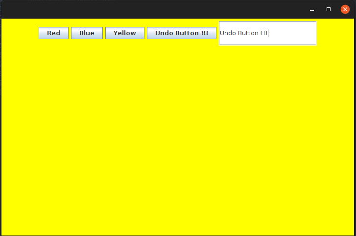

## Design-patterns - Mediator

In this exervice you will take the application of the previous laboratory and implement the Mediator pattern.

The git repo has 3 branches

- exo ( fill-in-the-blank code )
- main ( solution of the exercise )

# Instructions

1. Complete the TODOs in :

- `Button.java`
- `UndoButton.java`
- `TextField.java`

2. Complete :

- `ApplicationPanel.java`
- `Pane.java`

2. Execute the application

```bash
java -D -cp bin Main
```


